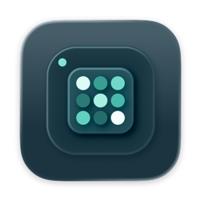
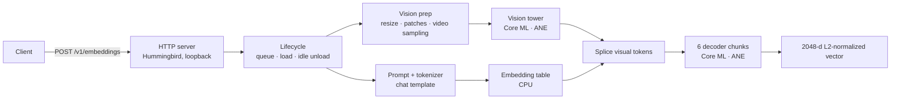

<div align="center">



# Embed ANE

[](LICENSE)
[](https://swift.org)
[](#requirements)
[](https://huggingface.co/maolon/WeMM-Embedding-2B-CoreML-ANE)

**A private, always-on embedding service for your Mac, so local search, RAG and AI agents can index text, images and video without the cloud and without tying up the GPU.**

[Why](#why-it-exists) • [Quickstart](#quickstart) • [Performance](#measured-performance) • [API](#api-reference) • [Architecture](#architecture)

</div>

---

## Why it exists

Retrieval needs embeddings: to search your notes, screenshots, photos and recordings by meaning, or to give a coding agent or chat assistant memory of your files. Today that usually means one of two compromises:

- **Send your data to a cloud embedding API.** Every document, image and clip leaves your machine, costs money per call, and needs a network connection.
- **Run an embedding model on the GPU.** The GPU is what your local LLM, editor and display need, so indexing competes with them, and long jobs spin up the fans.

Embed ANE removes both compromises. It runs an open multimodal embedding model, [WeMM-Embedding-2B](https://huggingface.co/tencent/WeMM-Embedding-2B), on the **Apple Neural Engine**: dedicated silicon that sits idle on most Macs. Your data never leaves the machine, the GPU stays free for generation, and the Mac stays quiet while a background indexer works through thousands of items.

It is built to be **infrastructure you forget about**:
- a menu bar app (or CLI daemon) that can start at login;
- one OpenAI-compatible endpoint, `POST /v1/embeddings` on `127.0.0.1`, that any RAG framework, vector database client or agent tool can use unchanged;
- text, images and video in **one vector space**, so a text query finds the screenshot or clip it describes.

Typical uses: semantic search over a personal knowledge base, photo or screen-recording search, local RAG for a self-hosted LLM, and memory for coding agents. All of it runs offline.

## Measured performance

| Metric | Measured result |
| --- | --- |
| **Text latency** | 1.5 s per request (median, warm) |
| **Image latency** | 2.5 s per image + text (672×448) |
| **Video latency** | 3.9 s per clip (8 frames, 57 s source) |
| **Memory** | 2.0 GB physical footprint with the model loaded, Neural Engine included |
| **Accuracy** | cosine 0.977 (text, mean) / 0.949 (image) / 0.920 (video) vs. the original fp32 model |
| **Download** | 4.2 GB, every file SHA-256 verified |

*Measured on an M1 Pro (macOS 27) through the HTTP endpoint; method in [docs/accuracy.md](docs/accuracy.md).*

---

## Features

### One model for text, images and video
Text, images and short videos share one vector space, so a text query can retrieve a screenshot or a clip. Images and videos are embedded together with optional text, using the original model's prompt format exactly.

### Drop-in OpenAI API
Point any OpenAI client at `http://127.0.0.1:8080/v1` and call `embeddings.create`. Strings, string arrays and token arrays work unchanged. Images and videos use content parts (see [API](#️-api-reference)).

### Neural Engine, not GPU
All 24 decoder layers and the vision encoder run as Core ML programs on the ANE. A request costs a fraction of a watt, and the GPU stays free for everything else.

### Lives in the menu bar
The menu bar glyph shows the model state at a glance (ready, standby, loading, error). From the menu you can copy the endpoint, load or unload the model, switch models and open the dashboard: Overview, Models, Playground and Logs.

<!-- TODO screenshot: docs/assets/menu.png -->

### Local and verified
The server listens on loopback only. Models download from Hugging Face against a digest-pinned spec, and every file is checked before it loads. Request text, images and vectors are never logged.

### Memory on demand
Keep the model loaded, or unload it after an idle period and reload it on the next request.

---

## How it compares

| | Embed ANE | Cloud embedding APIs | GPU runtimes (MLX, llama.cpp, Ollama) |
| --- | --- | --- | --- |
| **Data leaves the Mac** | No | Yes | No |
| **Text + image + video** | Yes | Varies | Mostly text |
| **Runs on** | Neural Engine | Remote servers | GPU / CPU |
| **Fan noise and GPU contention** | Minimal | None locally | Noticeable under load |
| **OpenAI-compatible** | Yes | Yes | Varies |

Embed ANE complements [Anemll](https://github.com/Anemll/Anemll), which runs chat LLMs on the ANE: Anemll generates text, and Embed ANE does retrieval embeddings.

---

## Quickstart

### Requirements
Apple silicon, macOS 15 or later, and about 5 GB of free disk space (4.2 GB of model files plus the Neural Engine compile cache). Keep some headroom: when the startup disk is nearly full, macOS may clear the compile cache, and the next load then has to recompile.

### For humans
1. Download `Embed-ANE-<version>.dmg` from [Releases](https://github.com/Maolon/embed-ane/releases), open it and drag **Embed ANE** to Applications.
2. The build is ad-hoc signed, so the first time, Control-click the app and choose **Open**, or run `xattr -dr com.apple.quarantine "/Applications/Embed ANE.app"`.
3. Click the menu bar glyph, then **Open Embed ANE… → Models → Add Model → Hugging Face → Download**. The default repository is `maolon/WeMM-Embedding-2B-CoreML-ANE`.
4. Choose **Use This Model**. The first load compiles the model for the Neural Engine, which takes a few minutes once. After that, choose **Copy Endpoint URL** from the menu.

### For AI coding agents
```bash
# CLI (from the release tarball, or: swift build -c release)
embed-ane fetch maolon/WeMM-Embedding-2B-CoreML-ANE   # download + verify (4.2 GB)
embed-ane serve                                        # http://127.0.0.1:8080/v1
```
```python
from openai import OpenAI
client = OpenAI(base_url="http://127.0.0.1:8080/v1", api_key="local")
vectors = client.embeddings.create(model="wemm-embedding-2b-ane",
                                   input=["How is mapo tofu prepared?"]).data
```

---

## API reference

`POST /v1/embeddings` follows the OpenAI embeddings API: `input` (string, array of strings, array of token ids, or array of token-id arrays), optional `dimensions` (1–2048, Matryoshka truncation with renormalization) and `encoding_format` (`float` or `base64`).

Images and videos use **content parts**. This is an extension of the OpenAI format, and each request embeds one image or one video together with the text parts:

```json
{
  "model": "wemm-embedding-2b-ane",
  "input": [
    {"type": "image_url", "image_url": {"url": "data:image/png;base64,iVBORw0..."}},
    {"type": "text", "text": "a red bicycle"}
  ]
}
```
```json
{"input": [{"type": "video_url", "video_url": {"url": "file:///Users/me/clip.mp4"}}]}
```

| Input | Accepted | Limit |
| --- | --- | --- |
| Text / tokens | strings or token ids | 507 tokens per input, up to 8 inputs per request |
| Image | `data:image/*;base64,…` or `file:///absolute/path` | 64 MiB, at most 384 visual tokens |
| Video | `file:///absolute/path` (`.mp4`, `.mov`, …) | 2 GiB; sampled at 2 fps, 4–8 frames |

Files on external volumes or in Desktop, Documents and Downloads are protected by macOS: the first request for such a path makes macOS ask whether Embed ANE may read it. Allow it in the prompt or under System Settings > Privacy & Security > Files and Folders. Until then the request fails after 20 seconds with an error that says so.

Other endpoints: `GET /health` (state, queue, memory). The full contract is in [SPEC.md](SPEC.md) and [docs/](docs/).

CLI commands:

| Command | What it does |
| --- | --- |
| `embed-ane fetch <spec.yaml \| org/name>` | Download and verify a model into `~/.embed-ane/models` |
| `embed-ane verify <model-id>` | Re-check every file digest of an installed model |
| `embed-ane serve [--port N]` | Run the HTTP server |
| `embed-ane status` | Show server state |
| `embed-ane bench <corpus.txt>` | Measure latency on your text |

Configuration lives in `~/.embed-ane/config.yaml`; the menu bar app's Settings window edits the same file.

---

## Architecture



- **EmbedANECore**: tokenizer, prompt template, vision preprocessing, the Core ML cascade and the model lifecycle.
- **EmbedANEHTTP**: the OpenAI-compatible server.
- **EmbedANEDownload**: digest-pinned Hugging Face downloads.
- **`embed-ane`**: the CLI.
- **App**: the SwiftUI menu bar app.

The model is converted from the original weights to fp16 Core ML; the [model card](https://huggingface.co/maolon/WeMM-Embedding-2B-CoreML-ANE) lists every change.

### Build from source
```bash
swift build && swift test          # library, server and CLI
bash scripts/build-app.sh          # unsigned app (needs Xcode 26+)
bash scripts/package-dmg.sh 1.0.0  # ad-hoc signed DMG + CLI tarball in dist/
```

---

## Contributing

Issues and pull requests are welcome; see [AGENTS.md](AGENTS.md) for the module layout, test commands and rules (no model files in this repository).

## License

Apache-2.0, see [LICENSE](LICENSE). The model weights are © Tencent under Apache-2.0 with third-party components under their own licenses; see the [model card](https://huggingface.co/maolon/WeMM-Embedding-2B-CoreML-ANE). Please cite the [WeMM-Embedding technical report](https://arxiv.org/abs/2608.24053) when you use the model.
